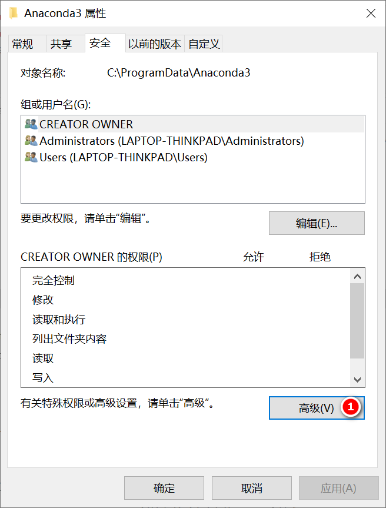

安装了anaconda之后，有时安装扩展包的时候，可能出现如下的权限错误：

```text
The current user does not have write permissions to the target environment
```

这个错误代表当前用户没有访问anaconda文件夹的权限，一个临时的解决办法就是安装扩展的时候，使用包含了administrator权限的终端进行安装。另外一个方法就是修改anaconda的权限。

  

  
